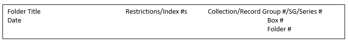

## Phase II: Processing

The processing phase of each assignment begins with establishing the
current arrangement of the material, evaluating the arrangement needs,
and crafting an arrangement proposal for the project. The proposed
arrangement should then be approved by the Head of Processing and stated
in the Project Vitals.

 **_Arrangement_**

Arrangement is the organizing and sequencing of materials in a
collection in a meaningful way. More specifically, it is the process of
ordering materials with respect to _provenance_ and _original order_ to
preserve context and to attain physical and intellectual control of the
holdings.

_Describing Archives: A Content Standard_ _(DACS)_ defines the process
of arrangement as: "identifying the logical groupings of materials
within the whole as they were established by the creator, of
constructing a new organization when the original ordering has been
lost, or of establishing an order when one never existed. The archivist
may then identify further subgroupings within each unit down to the
level of granularity that is feasible or desirable. This process creates
hierarchical groupings of material, with each step in the hierarchy
described as a level." [(_DACS 2013, Principle 3, p.xvii_)](https://www2.archivists.org/standards/DACS/statement_of_principles).

The hierarchical levels commonly used at RAC are: Collection, Record
Group, Subgroup, Series, Subseries, and File.

_Item-level description is extremely rare, and such detailed description
must be pre-approved by the Head of Processing._

The concepts of archival arrangement apply to the organization of all
records regardless of format, including paper collections, audiovisual
collections, digital collections, and "hybrid" collections which consist
of multiple formats including paper and digital files. When arranging
hybrid records -- whether representing original order, maintaining an
existing order, or otherwise establishing an arrangement -- the archival
arrangement is pertinent to all holdings across all applicable
hierarchical levels and should be designated and expressed consistently
regardless of the format being arranged.

Description reflects arrangement, but the physical arrangement of the
items in a collection may or may not parallel the intellectual
arrangement. Items that are described together may be stored separately
because of their differing size, shape, condition, access or use
conditions, physical composition, format or other factors.

### Arrangement

#### Step 9 - Follow Arrangement Recommendations in Project Vitals

#### Step 10 - Standard Arrangement

The most common and often the most appropriate arrangement action is to
leave things as they are. In such cases, the processing archivist
should:

-   Maintain original order/as received

-   Conduct minimal physical arrangement

-   Not undertake rearrangement of material within folders

**Whenever it exists, original order should be maintained.** Original
order represents the creator’s structure, and reveals information about
the creator, the use of the records, and the relationship among and
between the files. However, in cases in which the original order is
indiscernible or untenable, introducing or establishing a workable
arrangement is an acceptable option. As stated in the Society of
American Archivists online glossary, “archivists are not required to
preserve ‘original chaos’ and may arrange such materials in a way that
facilitates their use and management without violation of any archival
principle.”

Often it may not be known if the existing arrangement comprises the
original order. In cases such as this, the processing archivist consider
retaining the existing order “as received”.

In addition to Original Order or “As Received”, common arrangement types
include: Type/Format; Activity/Function; Alphabetical; and Chronological
order.

_Arrangement creates an intellectual and most often a physical structure
for a collection, with the objective of enabling accurate descriptions,
which lead to efficient access and management. Effective arrangement
opens collections to research as quickly as possible, but it is not a
tool used to create perfectly manicured collections. If assigned a
project which necessitates considering arrangement options, **consult
the Head of Processing and receive his/her approval before proceeding to
alter the existing arrangement.**_

#### _Description_

Once an arrangement plan is chosen, archival description begins, and
this work continues through all phases of the project until completion.
As processing of a given collection concludes, the Processing Team
periodically takes further steps to evaluate, improve, and optimize the
description through editing and updating all collection guides as
necessary.

Description is the creation of an accurate representation of the
archival material by the process of capturing, collating, analyzing, and
organizing information that serves to identify archival material.
Description also explains the context and records systems that produced
the archival material, as well as the results of these processes.

The RAC has adopted the Society of American Archivists’ endorsed
_Describing Archives: A Content Standard (DACS)_ to govern the archival
description of all RAC archival holdings, regardless of form, medium or
creator (individuals, families or corporate bodies). For details, please
refer to <http://www2.archivists.org/standards/DACS>.

Archival description most often consists of a multi-level structure that
reflects the arrangement of the material, and the relationship between
those levels, beginning with a description of the whole and most often
continuing with description of the parts. It may consist only of a
description of the whole, but most often the description tends to be
more and more detailed with progression through the parts. Within a
given collection or project, and depending on the chosen processing
level, some parts may be described at greater or varying levels of
detail, with the resulting finding aid intentionally flexible in order
to produce a variety of descriptive outputs.

### Building the Finding Aid

At RAC all archival description is recorded in our collections
management system (ArchivesSpace), and all completed processing projects
are displayed online through our collection guides website DIMES.

100% of our online guides conform to DACS single-level minimum
compliance. To ensure that the quality and completeness of our guides is
maintained, we take steps to comply with DACS as soon as the initial
draft finding aids are created.

#### Step 11 - Receive a Resource ID from the Head of Processing [(DACS 2.1.3)](https://www2.archivists.org/standards/DACS/part_I/chapter_2/1_reference_code)

-   Each resource record/finding aid at RAC is assigned a unique ID.

-   Resources created during Processing are assigned a FA\#.

-   Resources created during Accessioning are assigned an AC\#.

-   AC\# records may be converted to FA\# during processing.

-   The Resource ID (FA\#) may be included in the Project Vitals or may
    be assigned at a later date (as needed).

#### Step 12 - Create (or receive from the Head of Processing) a Shell Resource Record in ArchivesSpace for the Finding Aid

-   For assistance or instruction with creating the shell, please see
    the Head of Processing.

#### Step 13 - Establish DACS Single-Level Minimum Compliance at the Collection Level/Highest Level of the Finding Aid

1.  Title (Collection Level/Highest Level of finding aid) [**(DACS 2.3)**](https://www2.archivists.org/standards/DACS/part_I/chapter_2/3_title)

RAC has established a normalized descriptive Naming Convention, which
augments DACS guidelines, pertinent only to the top level of a finding
aid.

For archives consisting of multiple collections, the title consists of:

-   The name of the Creator (individual, corporate body) + the term
    records, papers or collection (as applicable) + the collection name.    

 - Examples -

    

    

    
Ford Foundation records, Oral History Project

    
Ford Foundation records, Urban Poverty Program, Office Files of
      Robert Curvin

    
Rockefeller University records, Plant Operations

    
Rockefeller University records, President, Joshua Lederberg

    
Rockefeller Foundation records, Cox and Reece Investigations

    

    

For Rockefeller University faculty or Rockefeller Institute for Medical
Research Scientific Staff collections, the title consists of:

-   The name of the Creator (individual) + the term papers or collection
    (as applicable) + the term Rockefeller University Faculty or
    Rockefeller Institute for Medical Research Scientific Staff (as
    applicable). Examples –

    

    

    
Ralph Steinman papers, Rockefeller University Faculty

    
Maclyn McCarty papers, Rockefeller University Faculty

    
Max Bergman papers, Rockefeller Institute for Medical Research
      Scientific Staff

    

    

The top level presented in RAC's finding aids vary depending on the
level being described (Collection, Record Group, Subgroup, Series,
Subseries). When describing components within a collection at the
highest level of a finding aid, the title consists of:

-   The name of the Creator (individual, corporate body) + the term
    records, papers or collection (as applicable) + the name and number
    (or letter) of the component being described. Examples -

    

    

      
Commonwealth Fund records, Commission on Women's Health, SG 2, Series 4

      
Rockefeller Foundation records, Projects, RG 1.2

      
Office of the Messrs. Rockefeller records, Cultural Interests,
        Series E

      
Nelson A. Rockefeller Gubernatorial records, Speeches, Series 33

      
Nelson A. Rockefeller Vice Presidential records, New York
        Office, Series 10

    

    

Consult the Head of Processing for more information regarding the RAC
Naming Convention.

#### _Additional Required Collection Level Elements_

2\.  Extent [**(DACS 2.5)**](https://www2.archivists.org/standards/DACS/part_I/chapter_2/5_extent) (in cubic feet and/or born-digital in estimated number of files and MB/GB or appropriate measure)  

  - 1 record storage box = 1.3 cu. ft.

  - 1 letter document box = 0.38 cu. ft.

  - 1 legal document box = 0.47 cu. ft.

  - 1 letter half-document box = 0.19 cu. ft.

  - 1 legal half-document box = 0.24 cu. ft.

  - Example: 30 cu. ft. and 3000 digital files (1 GB)

3\.  Date [**(DACS 2.4)**](https://www2.archivists.org/standards/DACS/part_I/chapter_2/4_date)

  - Record inclusive date when known (Begin Year–End Year).

  - Recording bulk date is optional.

  - Date may initially be recorded as “undated” in order to save the
        shell record.

4\.  Language (English) [**(DACS 4.5)**](https://www2.archivists.org/standards/DACS/part_I/chapter_4/5_languages_and_scripts_of_the_material)

  - Records the Language term and code predominately represented in
        the material described.

  - The overwhelming majority of RAC’s collections are in English.

  - A natural language note should also be recorded at the top level of the finding aid for user readability.

5\.  Creator/Author [**(DACS 2.6)**](https://www2.archivists.org/standards/DACS/part_I/chapter_2/6_name_of_creators)

  - Record the provenance of the material in the “Agent Links” in
        ArchivesSpace.

  - In rare cases it is appropriate to record multiple creators.
        Limit creators to a maximum of three.

  - If the creator is unknown, “Source” can be used as an acceptable
        substitute.

6\.  Scope and Content [**(DACS 3.1)**](https://www2.archivists.org/standards/DACS/part_I/chapter_3/1_scope_and_content)

The processing archivist should document the nature of the materials and activities reflected in the unit being described to enable users to judge its potential relevance. The Scope and Content may include information about any or all of the following, as appropriate:

-   The function(s), activity(ies), transaction(s), and process(es) that
    generated the materials being described  

-   The documentary form(s) or intellectual characteristics of the
    records being described (e.g., minutes, diaries, reports,
    watercolors, documentaries)  

-   The content dates, that is, the time period(s) covered by the
    intellectual content or subject of the unit being described  

-   The geographic area(s) and places to which the records pertain  

-   The subject matter to which the records pertain, such as topics,
    events, people, and organizations  

-   Any other information that assists the user in evaluating the
    relevance of the materials, such as completeness, changes in
    location, ownership, and custody while still in the possession of
    the creator, etc.  

-   This information should be derived from the materials themselves and
    any relevant documentation.  

-   When the unit being described is known to be incomplete due to
    reasons other than archival appraisal decisions, information about
    the gaps should be recorded.  

7\.  Conditions Governing Access [**(DACS 4.1)**](https://www2.archivists.org/standards/DACS/part_I/chapter_4/1_conditions_governing_access)

#### _General Collection-Level Access Statements Approved for Use at RAC_

The following four approved collection-level standard access statements
cover the large majority of RAC collections. Select the access statement
that fits the collection. If the project entails processing a collection
with unique conditions, contact the Head of Processing.

**General Collection-Level Access Statement I**

Open for research. Brittle or damaged items are available at the
discretion of RAC.

-   Basic Access Statement I is appropriate if/when the
    collection/finding aid contains only open materials and includes NO
    digital, AV, film, or memorabilia items.

**General Collection-Level Access Statement II (appropriate for many RAC
collections)**

Open for research with select materials restricted as noted. Brittle or
damaged items are available at the discretion of RAC. Researchers
interested in accessing digital media (floppy disks, CDs, DVDs, etc.) in
this collection must use an access surrogate. The original items may not
be accessed because of preservation concerns. To request an access
surrogate be made, or if you are unsure if there is an access surrogate,
please contact an archivist.

When requesting to view audiovisual material, please refer to the Title
and the AV Number (example: AV 1916). Researchers are asked to check the
"Restrictions" note for each Title. If a Title does not currently have
an access copy, please contact a RAC archivist for further instruction.

**General Collection-Level Access Statement III (For materials governed
by a date embargo)**

Records more than (25/10/XX) years old are open for research with select
materials restricted as noted. Brittle or damaged items are available at
the discretion of RAC. Researchers interested in accessing digital media
(floppy disks, CDs, DVDs, etc.) in this collection must use an access
surrogate. The original items may not be accessed because of
preservation concerns. To request an access surrogate be made, or if you
are unsure if there is an access surrogate, please contact an archivist.

When requesting to view audiovisual material, please refer to the Title
and the AV Number (example: AV 1916). Researchers are asked to check the
"Restrictions" note for each Title. If a Title does not currently have
an access copy, please contact a RAC archivist for further instruction.

**General Collection Level Access Statement IV (For Rockefeller family
collections)**

Open for research with select materials restricted as noted. Brittle or
damaged items are available at the discretion of RAC. Material in the
Rockefeller family collections that provides the names, correspondence,
or activities of living members of the Rockefeller family, and/or
documents the net wealth of any Rockefeller family members, is
restricted. Researchers interested in accessing digital media (floppy
disks, CDs, DVDs, etc.) in this collection must use an access surrogate.
The original items may not be accessed because of preservation concerns.
To request an access surrogate be made, or if you are unsure if there is
an access surrogate, please contact an archivist.

When requesting to view audiovisual material, please refer to the Title
and the AV Number (example: AV 1916). Researchers are asked to check the
"Restrictions" note for each Title. If a Title does not currently have
an access copy, please contact a RAC archivist for further instruction.

_Notes on the four general collection-level access statements_

-   The term “with select materials restricted as noted” should be added
    or removed depending on if the contents of the entire guide are
    open.

-   The portion of the statement pertaining to digital and/or
    audiovisual materials (see below) should ONLY be included if the
    collection/finding aid actually contains those materials.

**_Format-Based Collection Level Access Statements Approved for Use at
RAC_**

The access statement used should only refer to the terms of access for
specific formats if those formats are indeed found in the
collection/finding aid being described.

**1.  For collections/finding aids which contain digital media the
    following language should be added to the end of the access
    statement --**

  

    

      Researchers interested in accessing digital media (floppy disks, CDs,
      DVDs, etc.) in this collection must use an access surrogate. The
      original items may not be accessed because of preservation concerns. To
      request an access surrogate be made, or if you are unsure if there is an
      access surrogate, please contact an archivist.
    

  

**2.  For collections/finding aids that contain audiovisual materials
    the following language should be added to the end of the access
    statement --**

  

      

      

      When requesting to view audiovisual material, please refer to the Title
      and the AV Number (example: AV 1916). Researchers are asked to check the
      "Restrictions" note for each Title. If a Title does not currently have
      an access copy, please contact a RAC archivist for further instruction.
      

      

      All inquiries to view films require advanced notice of at least 2
      business days, and may necessitate notice of up to one week. Individual
      items, including those that are not available in modern formats, may be
      restricted from access at the discretion of RAC.
      

      

  

**3.  For collections/finding aids that contain memorabilia/realia the
    following language should be added to the end of the access
    statement --**

  

      

      All inquiries to view memorabilia require advanced notice of at least 2
      business days, and may necessitate notice of up to one week. Items are
      available at the discretion of RAC.
      

  

#### Step 14 - Add Additional Required Elements to the Shell Record

In addition to single level compliance – RAC required data elements for
the shell include:

1.  Finding Aid Title

    -   The bibliographic title of the finding aid itself.

    -   The standard term “A Guide to the….” Is used to differentiate
        the finding aid title.

        

        

        For example: “A Guide to the Warren Weaver papers”

        

        

2.  Finding Aid Filing Title

    -   An edited version of the Formal Title intended to facilitate
        searching, sorting and browsing of finding aids.

    -   In most cases, the Finding Aid Filing Title is the same as the
        Formal Title. For example:

        

        

        
Rockefeller Brothers Fund records

        
William T. Grant Foundation records

        
Ford Foundation records, Office of Communications, Advisor on Communications, Office Files of Fred W. Friendly

        

        

    - For personal papers, the Finding Aid Filing Title should be listed
        with the last name first, followed by other names in parenthesis.

        

        

        

        Weaver (Warren) papers
        

        

        Frantz (Harry S.) papers
        

        

        Harrar (J. George) papers
        

        

        

3.  EAD-ID (FA\#.xml)

    -   This is the unique identifier for the EAD file which is exported
        out of the collections management system for online display in
        DIMES.

    -   PDF versions of the EAD file can also be exported.

### Create Inventory

#### Step 15 - Create Inventory, or Build Upon/Revise/Confirm Existing Inventory

-   At Processing Level 1, particularly during initial ingest and
    accessioning, the minimum requirement is single-level general
    description of contents, which can serve in lieu of an inventory.

-   General description can be a summary statement describing the whole
    such as:

    

    

    Accession contains grant files, Board of Directors records, and
        subject files.

    

    

-   General description of contents from an appraisal report, or from
    documents provided by the donor/depositor, could also serve in lieu
    of an inventory.

-   Ideally, the donor/depositor will provide RAC with an inventory.

-   If the inventory prepared by the donor/depositor adequately meets
    basic processing requirements, no additional RAC-produced inventory
    is required at accessioning.

-   For the purposes of Level 1 inventorying, file-level description
    also can be utilized to generally describe the contents of an entire
    file, often spanning multiple folders or multiple boxes, with
    individual instances assigned for each box. For Example:

    

    

      
Title: Grants, A-D

      
Instance 1: Box 1  
       Instance 2: Box 2

      
Title: Board of Directors

      
Instance 1: Box 4  
       Instance 2: Box 5

      
Title: Subject Files

      
Instance 1: Box 6

    

    

The inventory/container list, at all levels of Processing, should focus
on FILE LEVEL description, with each archival object/inventory entry
comprised of four vital parts

1.  Title

2.  Date

3.  Instance information

4.  Associated notes

Remember FILE LEVEL description does NOT equate to FOLDER LEVEL
description.

In multi-level description, always remember to focus on the level being
described (Collection, Record Group, Subgroup, Series, Subseries, File)
with the description reflecting the arrangement and the inherent
relationship among and between the records of each level.

#### _Describing Titles_

See [**section 2.3**](https://www2.archivists.org/standards/DACS/part_I/chapter_2/3_title) of _DACS_ for a complete description of the
guidelines for the title element. Guidelines for establishing name
authorities and forms of names including those of persons, families,
geographic names and corporate bodies are available [_in DACS -Part II_](https://www2.archivists.org/standards/DACS/part_II)
and [_Chapter 10_.](https://www2.archivists.org/standards/DACS/part_II/chapter_10)

-   Title is intent on concisely describing the content or nature of the
    file.

-   The Title for each file should answer the question – What is this
    file? Or, what is the content of this file?

      -    Example:

            

            

            Title: Board of Directors Meeting Minutes

            

            

-   The File Title can be a Formal Title (supplied by the creator) or it
    can be a Devised Title (created by the archivist during processing).

-   In multilevel descriptions the name segment, or a portion of the
    name segment, may be inherited from a higher level of description
    and may not need to be explicitly stated at lower levels.

A.  Titles should be brief, yet uniquely identify the material.

B.  Titles should not end with a period.

C.  When listing the contents of a file in an alphabetical run, list the
    letters actually found within the run, such as “A-Z”, or portion of
    the run, such as “C-Y”. If unaware of the specific letters
    represented, use “A-Z”.

D.  Use a comma when recording locations. For example: Cummings Lecture
    at the Educational Alliance, New York City

E.  All RAC finding aids should be written predominantly using the
    English language. When working with titles in languages other than
    English, use the original title when feasible. If the language in
    question uses a different alphabet, such as Russian, provide an
    English language description of the type of records housed in the
    file (if known) and include a language of materials note at the
    appropriate level to indicate the language used.

- Example:

    

    

    
Title: Reprint

    
Language of materials note: In Russian

    

    

    ---

#### _Recording Names in the Title Element_

_It is important to note that this section addresses NAMES USED IN THE
TITLE ELEMENT ONLY. If a name has been chosen for recording in the name
of creator element, an authority record, or as an access point, the form
of that name is established by approved sources and national standards,
such as the Library of Congress Authorities and the Library of Congress
Subject Headings._

A.  Record the name(s) of the person(s), family (families), or corporate
    body predominantly responsible for the creation, assembly,
    accumulation, and/or maintenance of the records. [(**DACS 2.3.4**)](https://www2.archivists.org/standards/DACS/part_I/chapter_2/3_title)

B.  Record the name(s) in the form by which the creator(s) or
    collector(s) is generally known, and by using the natural language
    order of the English language (or the natural language order of the
    language of the person or corporate body’s country of residence)
    [(**DACS 2.3.5**).](https://www2.archivists.org/standards/DACS/part_I/chapter_2/3_title)

  

  

  Example: Detlev W. Bronk

  

  

In ordered lists, the Surname (often the name by which the creator is generally known) can be presented first.

  

  

  Example: Bronk, Detlev W.

  

  

C.  Abbreviations are strongly discouraged.

When recording the name of an individual, family, or a corporate body, use the full name rather than an abbreviation. For example, Detlev W. Bronk should be used rather than DWB or DB. Use of abbreviations, instead of the full names, for a limited number of the most commonly found names in the RAC collections is acceptable (such as the abbreviation JDR Jr. for John D. Rockefeller Jr.). Use of abbreviations is also approved when an abbreviation is commonly known and used by the general public.

- Example:

    

    

    
NATO can be used rather than North Atlantic Treaty Organization

    
FBI can be used rather than Federal Bureau of Investigation

    

    

D.  Acronyms should be spelled out, with the full name followed by the
    acronym provided in parenthesis. This allows researchers to search
    for terms using the name or the acronym.

- Example:

    

    

    National Academy of Sciences (NAS)

    

    

E.  Titles recording multiple names should be written as follows:

-   If three or fewer persons are credited with, or predominantly
    responsible for, the creation of the materials as a whole, record
    their names in direct order. [(**DACS 2.3.7**)](https://www2.archivists.org/standards/DACS/part_I/chapter_2/3_title)

-   If more than three persons are responsible for the creation of the
    materials, record the name of the individual who predominates.
    [(**DACS 2.3.8**)](https://www2.archivists.org/standards/DACS/part_I/chapter_2/3_title) Optionally, include all the names of the persons
    who are credited with or predominantly responsible for the creation
    of the materials. [(**DACS 2.3.9**)](https://www2.archivists.org/standards/DACS/part_I/chapter_2/3_title)

 -  Examples:

    

    

    
John Smith and Al Jones

    
John Smith, Al Jones, and Paul Adams

    

    

If 6 people are responsible for creating the materials and John Smith predominates, record John Smith as the title (or the names of all 6 people)

F.  If multiple files contain the same basic title, with varying added
    components, the components should be subdivided with a hyphen or
    colon to signify subordination.

- Examples:

    

    

    
Job Jackets - Maps for Trustees

    
Job Jackets - Open House

    

    

    G.  Titles physically written or recorded on folders may be abbreviated
    or truncated. Corresponding finding aid description should follow
    all stated rules and guidelines.

#### _Describing Dates_

-   Answers the question – When is the content of this file created?  

-   It can be a single date (like the date of a meeting), or a range of
    inclusive dates.

-   At RAC the date assigned is most often an inclusive date.

-   Date should be expressed as year month day.

      

      

      For example: 1982 April 5.

      

      

-   When describing consecutive spans of years, record the full years:

      

      

      1941-1944.

      

      

-   When describing multiple non-consecutive dates, use a comma:

      

      

      1941, 1953, 1962.

      

      

-   Date ranges that encompass a combination of consecutive and
    non-consecutive date spans should be recorded as: 1941-1944, 1953.

-   If the material in the file is not dated, record it as “undated”.

-   If file contents are differentiated by months rather than years,
    record the dates as:

    

    

       
1915 January-May

       
1915 June-December

    

    

-   If the contents are differentiated by days, or days, months, years,
    record dates as:

    

    

    
1915 January 5-12

    
1915 January 5-June 30

    
1915 January 5-1916 March 10

    

    

-   If the dates of the material are unknown, leave the field blank.

#### _Instance Information_

-   Instance information should answer the question – Where is the file?

-   The instance connects intellectual control with physical control of
    the file.

-   FILE LEVEL description does not directly equate to FOLDER LEVEL
    description.

-   Instance Information records the carrier or container. Most often
    the container is a Box, Box/Folder. In some cases, it is used to
    record the Reel/Frame of microforms, or the Unique ID (AV#) of an
    audiovisual item.

-   The primary instance (most often a “Box”) is designated as a Top
    Container. For assistance with Top Container creation see Head of
    Processing.

-   It also records the instance type – most often “Mixed Materials”.
    “Microform”, “Moving Image”, “Still Image” are also common types
    used.

#### _Associated Notes_

-   Notes most often used at the FILE Level are the Conditions of Access
    note, and the Physical Description note (which is used to answer the
    question – What is this physically?).

-   Here are a variety of examples of File Level Description –

      

      

      

       Title: Board of Directors Meeting Minutes
       Date: 1947
       Instances: Box 1, Folder 1
       Associated Notes: Only used when pertinent.
      

      

       Title: Board of Directors Meeting Minutes
       Date: 1948-1952
       Instances: Box 1, Folders 1-5
      

      

       Title: Board of Directors Meeting Minutes
       Date: 1953 June-1954 July
       Instance: Box 2
      
   

      

       Title: Board of Directors Meeting Minutes
       Date: 1955 July 1-1958 July 15
       Instances:
       Instance 1: Box 2
       Instance 2: Box 3
       Instance 3: Box 4
      

    

    

When the instances span multiple boxes, assigning each box to a separate
instance allows each box to be designated as a Top Container and each
barcode to be individually documented.

### Stabilize and Describe At-Risk materials

#### Step 16 – Stabilize and Describe At-Risk Materials

Identify and provide care for those materials, regardless of format, that are at greatest risk for obsolescence or data loss to facilitate their stabilization, preservation, further processing, and researcher access.   

Most at-risk materials should be retained within the originating collection. Some
commonly found at-risk materials should be transferred to the Library collection, while
others require specialized care to enable their preservation, facilitate migration,
extend their lifespan, or otherwise limit the risks of loss.  

#### Materials to be transferred to the Library collection

-  *An item belongs to either the RAC Archive or the RAC Library collection, not both.*

-	 The library collection consists of stand-alone items, independent of archival    
    provenance, which are most often described, stored and accessed at the item level.

-  Library holdings are described bibliographically.

-	 Eligible materials include but are not necessarily limited to:

    -   Collections or accessions whose entire contents is published materials within
    the scope of the RAC Library collecting policy.

    -   Published studies, reports and scientific or technical publications sponsored
    by, or otherwise produced through, direct grants or funding from RAC or a donor/depositor.

-	 No more than two copies of any publication will be acquired, cataloged and
    added to the Library collection. (Any additional copies should be submitted
    for disposal or return to the donor/depositor in accordance with RAC
    Collections Management procedure.)

-	 Bibliographic records will be created in the Collection Management system by RAC
    Collections Management/Library staff as applicable.

-  When transferring published materials to the RAC Library, the processing archivist
    should provide Collections Management/Library staff:

    -	  The Resource ID Number (FA#)

    -	  Accession/Collection Title

    -	  If no applicable Finding Aid is created, provide the accession number.

-	 No separation number(s) is assigned, and the separation sheet is not used.

-	 No archival description should be added to the finding aid.

_*All processed at-risk materials should be arranged in accordance with the Project
Vitals, approved by the Head of Processing, and described in the finding aid at
applicable levels within the originating context. Materials arranged and described
together may be physically stored separately. The associated description should also
detail any applicable conditions/restrictions of access and use as well as any
significant stabilization or preservation issues*_

#### Archival Materials to be retained within paper-based collections*

A.	All materials that are an integral part of the originating accession/collection should be retained, including those for which provenance and the contextual relationship among and between associated records is essential.

B.	Digital media.
-	  Digital media should be retained within the originating file or an
    accompanying associated file (as feasible), and inventoried at the
    file-level.

-	  When processing:

    -	  A physical description note should be included at the file-level
        indicating the existence of the digital media.

    -	  When the entire contents of the file is digital media, the INSTANCE TYPE
        “Digital” should be used.

    -	  When the file also contains paper records or other materials, the
        INSTANCE TYPE “Mixed Materials” should be used.

    -	  Include a conditions governing access note at the file-level indicating
        either of these two options (as applicable):

        - 1./	Access copy available.

        - 2./	Researchers interested in accessing digital media (floppy disks, CDs, DVDs, etc.) in this collection must use an access surrogate. The original items may not be accessed because of preservation concerns. Access copy currently unavailable. Please contact a RAC archivist for further instruction.

-	  The processing archivist will:

    -	  Receive training to develop the necessary proficiencies for each of the
        common removable media types and sizes.

    -	  Appraise and assess the eligibility of the item(s) for preservation in
        the RAC digital repository.

    -	  Image the removable media, note the presence of the item and document
        the imaging process in the digital media log and finding aid. [See Step 22](#image-eligible-digital-media) for details.

    -	  Describe the resulting file(s), within originating context, in aggregate
        in the finding aid and insert the applicable Processing Information
        Note.

    -	  After imaging the original digital media should be submitted for
        disposal in accordance with RAC Collections Management procedure.

C.	Oversized materials (larger than legal size: such as reports, studies or
ledgers), index cards, postcards, unrolled or flattened materials, or other such
files that can be appropriately preserved in specialized archival boxes.

-	  When processing:

    -	  Collaborate with Collections Management as necessary.

    -	  **Seek assistance from Collections Management to safely unroll or flatten
        applicable records.**

    -	  Remove the entire file from its existing housing or storage and rehouse
        or relocate the file in its entirety to appropriately-sized archival
        folders and/or boxes. This rehousing may involve one file, a group of  
        files, or the contents of an entire box. It should never involve an
        individual item(s).

    

      

      Example: rehousing material into legal-size box(es) and folder(s) that was originally folded/creased to fit in letter-size housing or vice versa.
      

    
  

    -	  No separation number(s) is assigned & the separation sheet is not used.

    -	  Finding Aid instance will designate the box and folder number(s) of the
        new container(s).

    -	  All appropriate Top Container data should also be recorded in the
        Collection Management System (Barcode, Location, & Container Profile).

    -	  Care of posters, blueprints and other flat files is addressed [below](#at-risk-materials-which-may-require-specialized-care).

D.	Still images or small items found within files of mixed materials.

-	  Individual items, small items (business cards, postcards, photographs,
    telegrams and greeting cards), or small volumes of still images should be
    retained within the originating file or an accompanying associated file (as
    feasible).

-	  When processing:

    -	  Stabilize the items in accordance with recommendations from Collections
        Management.

    -	  A physical description note should be included at the file-level
        indicating the existence of the still images.

    -	  When the entire contents of the file is images, the INSTANCE TYPE “Still
        Image” should be used.

    -	  When the file also contains paper records or other materials, the
        INSTANCE TYPE “Mixed Materials” should be used.

E.	Published articles, journals, magazines, papers, books, reprints, brochures, and
pamphlets (and any other publications less than 50 pages) found within files of mixed
materials.

-	  Published material that is an integral part of the content and context of
    the originating collection/accession, or otherwise benefits from the
    retention of archival provenance, should be retained within the originating
    file or an accompanying associated file (as feasible).

-	  Case by case recommendations will be addressed in Project Vitals preparation
    in coordination with recommendations of Collections Management/Library
    staff.

-	  Process and describe the materials in accordance with all RAC standard
    practices and procedures.

#### At-Risk materials which may require specialized care*

A.	Brittle or damaged items or materials with significant/immediate preservation
concerns.

-	  **Contact Collections Management immediately if the issue involves evidence
    of active, suspected, or dormant mold/mildew/pests.**

-	  Submit a **Collection Concern** form to Collections Management to document a
    non-immediate preservation issue(s).

-	  Collaborate with Collections Management as necessary and implement any
    recommendations received.

-	  _Completion of the processing entails fully addressing each preservation
    concern(s) and documenting the necessary care in the completed finding aid,
    including but not necessarily limited to stabilization and/or the
    creation/assignment of any applicable containers/instances._

-	  Select materials may require removal from the body of the collection, or
    from reference circulation, due to preservation concerns.

B.	Audiovisual materials

- 	Remove audiovisual material from its originating archival container and
    relocate the item(s) to a temporary container(s) exclusively holding AV
    material.

-	  This newly created temporary container(s) should be used to house all AV
    holdings for a given processing project.

-	  The number assigned to the temporary container should be “T 1”, “T 2”, etc.

-	  No separation number is assigned, and the separation sheet is not used.

-	  Finding Aid instance will designate the box and folder number(s) of the
    temporary AV container(s).

-	  The INSTANCE TYPE “Audio” or “Moving Image” should be used as applicable.

-	  All appropriate Top Container data should also be recorded in the Collection
    Management System (Barcode, Location, and Container Profile).

-	  After recording all applicable Top Container data, notify the Audiovisual
    Archivist via Project Management software (Asana) to inform him/her of the
    existence of the AV material.

-	  AV Archivist will assign permanent unique identifiers (AV Numbers), adjust
    the finding aid accordingly, and perform preservation tasks in accordance
    with the _Guide to Processing Collections at RAC_ and the Collections
    Management Manual.

-	  Large volumes of audiovisual materials may necessitate the creation of an
    Audiovisual Series or Component.

-	  Following digitization, the Processing Archivist may be consulted for
    creation of further metadata (Scope and Content note, etc.) or
    viewing/listening to the item(s) as applicable.

Describe audiovisual item(s) within originating context, using the following basic
information:

Title

-	  Description in the title element should be based on container and/or item
    annotations, usually on accessioning inventory spreadsheet.

-	  Title may be revised after the material in question has been digitized and
    played if content and/or title differs from original container/item
    annotations.

Level of Description: File

Dates

-	  Date for audiovisual materials is most often recorded as single creation
    date.

    -	  Label: Creation

    -	  Type: Single

    -	  Expression: YYYY-Month-DD (example: 1976 July 04)

-	  If recorded date is not a single creation date follow [standard practices](#describing-dates).

-	  Use “circa” or “c.” if approximating a date (example: c. 1970s)

Extent: TBD

Notes:

-	  **Conditions Governing Access** (choose appropriate note at the file-level)

    -	  Access copy available.

    -	  Access copy currently unavailable. Please contact a RAC archivist for
        further instruction.

    -	  [The AV collection-level-note](#general-collection-level-access-statements-approved-for-use-at-rac) can also be used at the series level.

-	  **Scope and Contents** (Collaborate with AV archivist to watch/listen to the
    material AFTER a digitized access copy is created, and generate applicable
    notes.)

-	  **Materials Specific Details** (Add format or film gauge from accession
    inventory.)

    

    

    Example: VHS, ¼ inch audio cassette, 16mm film.
    

    

    -	  [See PBCore controlled vocabulary](At-Risk materials which may require specialized care) or Audiovisual Archivist for details.

-	  **Physical Description** (Data should always be written in the sequence below.)

    -	  Silent or Sound, Black and white or Color, xx minutes.

    -	  Record, in Arabic numerals, the total duration/running time in minutes,
        normally rounded off to the nearest minute. Example: 75 minutes.

-	  **Physical Characteristics and Technical Requirements Note** (Not required;
    use only if needed to inform user of important playback issues.)

    

    

    Example: Sound has heavy static throughout recording; Image goes black intermittently near end of program.
    

    

For further assistance with the description of audiovisual materials please
refer to:

-	  The FIAF Moving Image Cataloguing Manual (2016):  <http://www.fiafnet.org/images/tinyUpload/E-Resources/Commission-And-PIP-Resources/CDC-resources/20160920%20Fiaf%20Manual-WEB.pdf>

-	  The Public Broadcasting Metadata Dictionary Project (PBCore) Controlled Vocabularies: <http://pbcore.org/updated-pbcore-controlled-vocabularies/>

C.	Materials whose composition or format places them in particular risk of
obsolescence or loss, such as:

-	  Flat files that will benefit from long-term flat or oversized storage
    (drawers, cabinets, rolled canisters) such as architectural drawings,
    blueprints, maps, plans, and posters.

-	  Ephemera, memorabilia, realia, and three dimensional objects.

-	  Photographic albums or large volumes of still images, and/or scrapbooks.

-	  Microforms (microfilm, microfiche, microform cards, or associated cartridges)  

-	  Seek assistance from, and work collaboratively with, Collections Management
    including formulating case by case recommendations in Project Vitals when
    feasible.

-	  Inform Collections Management when flat files are encountered during
    processing, so that the Collections Management team can assign suitable flat
    file storage space.

-	  Stabilize and house the materials in accordance with recommendations from
    Collections Management.

-	  No separation number(s) is assigned, and the separation sheet is not used.

-	  Finding Aid instance will designate the box and folder number(s) of the new
    container(s).

-	  INSTANCE TYPE should be recorded as appropriate (“Mixed Materials”, “Still
    Image”, “Bound Volume”, etc.).

-	  Inform Collections Management of all containers that house materials in this
    category (III.C) so that Collections Management can allocate space for these
    containers in suitable storage locations (Vault 105, Vault 106, Vault 107
    drawers).

-	  All appropriate Top Container data should also be recorded in the Collection
    Management System (Barcode, Location, and Container Profile).

### Rehouse Archival Materials

#### Step 17 - Rehouse Archival Materials and/or Retain Existing Housing

[(See Vitals)](planning#project-vitals-template)

-   Minimal Processing projects will most often retain existing housing
    when feasible.

-   Standard Processing projects will most often rehouse materials, with
    limited retention of existing housing when feasible.

_**Selecting Storage Containers and Enclosures**_

-   Select a box and folder size for documents based upon the dimensions
    of the majority of those to be contained within an enclosure. Most
    documents are up to 8 ½” in width and 11” in length, require a
    letter-size folder and box; papers larger than this size and up to 8
    ½” in width and 14” in length, require a legal-size folder and box.
    Box sizes may vary within a collection.

-   Do not combine ‘unlike’ items in the same box.

    

    

    
Examples:

    
Documents with metallic items (medals).

    
Documents with leather items which may be subject to deterioration
    (red rot) and bleed into the box.

    
Documents with liquid or powder in an envelope or container.

    

    

Coordinate with Collections Management whenever the project necessitates
the use of non-standard containers --- including but not limited to:
oversized or undersized flat boxes, clamshell boxes, index card boxes,
microform boxes, still image containers, newspaper-sized and textile
boxes, and flat files or tubes.

The Collections Management team can assist with:

-   Ordering, or confirmation of on-site availability, RAC-preferred containers.

-   Identifying box-types that may already be assigned container
    profiles in the RAC collections management system.

-   Measuring the boxes to create container profiles when needed.

-   Identifying and ordering of mylar, paper enclosures, support
    products, and other supplies which facilitate stabilization and
    long-term preservation.

### Dispose of Used Boxes

#### Step 18 - Dispose of Used Boxes (Place in Operations Assistant office on Basement Level)

-   Disposing of used or damaged containers in an efficient and timely
    manner assists RAC with the institutional objectives of providing
    safe, secure, and clean spaces throughout all public and staff
    spaces including processing space, office space, hallways, staging
    areas, and vault spaces.

### Label and Assign Instances

#### Step 19 – Label and Assign Instances (on Physical Files and in the Finding Aid, including Top Container/Container Profile)

-   For assistance with Top Container creation see Head of Processing.

-   Folders and boxes are commonly numbered consecutively from one box
    to the next. For example, if Box 1 contains Folders 1-10, then Box 2
    would contain Folders 11-20.

-   With prior approval of the Head of Processing, projects may be
    processed with Folder 1-Folder X recurring in each box.

-   Required elements of description which must appear on all archival
    folders:

      - Collection (Abbreviation)

      - Box Number

      - Folder Number

      - Folder Title (may be abbreviated or truncated on physical folder)

      - Date

-   Elements of description which must appear on the folder(s) (when
    applicable to the material being described):

      - Restrictions

-   Additional description that will appear on the folder(s) (only if
    pertinent to the material being described):

      - Record Group (Abbreviation or Number)

      - Subgroup (Abbreviation or Number)

      - Series (Abbreviation or Number)

      - Subseries (Abbreviation or Number)

      - Index Number

      - Grant Number

-   RAC archival description will appear on processed folders as:

### Preservation Issues

#### Step 20 - Submit Collection Concern form and discuss any Significant or Unexpected Preservation Issues with Collections Management.

#### Step 21 - Address Collection Concerns and Preservation Issues based on the Recommendations of Collections Management.

The **Collection Concern** form is currently located: **S:\Inter-Office\Archival\Forms.**

*Please consult with Collections Management to request a stabilization consult,* or if:

-   Material is damaged, torn or shedding.

-   Material has a particular odor or stickiness.

-   An unusual pattern exists on paper or film.

-   Edges of materials appear irregular or ragged and appear to have
    been ‘chewed’.

-   Material shows signs of active or dormant mold, mildew or water
    damage.

Mold and mildew are types of fungi which may appear as brown,
blue-black, or green irregularly-shaped spots. Mold will predominate
when environmental conditions exhibit fluctuations in temperature, high
humidity, moisture, and limited circulation. Mold often develops after
water damage has occurred. _When mold is discovered, it is crucial to
isolate any affected items to prevent further contamination. Please
take immediate action by referring any mold or mildew issues to
Collections Management._

Mold spores can easily spread. Do not attempt to remove mold with cloth.
Although mold is likely to be in its dormant stage when discovered, it
can be reactivated by compromising conditions.

**Conservation Treatment**

Conservation treatment of items often requires invasive procedures to
restore damaged and brittle paper including de-acidification,
fumigation, solvent treatments, polyester film encapsulation, and paper
strengthening. Such procedures require the expertise of an approved
conservator or an off-site conservation technician. If materials are
discovered that may benefit from or require conservation treatment,
please consult Collections Management.

##### Preservation During Processing

**A. Metal Fasteners, Paperclips, and More**

The physical condition, the nature and complexity of the records, their
associated research value, and the level of scholarly use the records
will receive following archival processing differ from collection to
collection or project to project. Therefore, issues regarding the
handling and/or removal of fasteners are addressed in the project
vitals.

A.  Fasteners serve a useful function in maintaining and preserving the
    physical and intellectual connections between the attached
    materials.

B.  All fasteners have the potential to damage records, particularly
    metal (non-stainless steel) fasteners which are subject to rust.

C.  It is neither necessary nor feasible to remove all fasteners from
    all archival materials during processing.

D.  To ensure the long-term preservation of the archival materials, all
    rusty fasteners should be removed and replaced with plastic or
    stainless steel fasteners, regardless of the processing level of the
    project.

E.  Often spiral bindings and ring binders are removed during archival
    processing, if removal of the bindings can be accomplished without
    damaging the archival materials. Any valuable information from the
    cover of a binder should be retained by inserting a preservation
    photocopy of the cover in the appropriate location within the file.
    Once any applicable information is retained, original binders should
    be thrown away.

**B. Unfolding / Flattening**

A.  Folded items should be unfolded and flattened during processing,
    unless doing so will damage the materials.

B.  Consult with Collections Management if the act of unfolding or
    flattening presents a high risk of damage to the archival material.

C.  In many cases, legal-size folders and/or boxes will accommodate the
    unfolded item(s). Material larger than a legal-size folder should be
    should be addressed in accordance with the practices for oversized material. Extremely large flat item(s) may be relocated to a map/flat file. [See Step 17](#rehouse-archival-materials).  

D.  If the present form of an original oversize item(s) holds no
    intrinsic value, a reduced-size photocopy of the item(s) can be made
    and retained in the file as replacement for the original(s).

E.  When unfolding an item, do NOT force its flattening or fold it
    against the crease, which can tear the fibers and weaken the paper.
    If an item will not lay open, lay it against a flat surface and
    carefully weigh it down with beanbags or other flat weights to
    encourage the folds to relax and straighten.

F.  Unfolded fragile material may be enclosed in Mylar to provide
    additional support to the records and/or exert a gentle flattening
    pressure on curling documents.

**C. Multiples**

A.  If multiple exact copies of reports or other records are found
    within a collection or folder, retain two copies. (Retention of more
    than two copies of any individual item is reserved only for items
    with great intrinsic or monetary value such as photographs or
    films). Shred excess copies.

B.  Copies of items with added research value, such as handwritten
    notations, comments, or revisions, are NOT considered exact copies,
    and should always be retained in the archival collection.

C.  Some collection agreements contain stipulations regarding permanent
    removal, destruction or final disposition of materials removed from
    the archival collection during processing. Please consult with the
    Head of Processing to determine the stipulations relevant to the
    assigned project.

**D. Preservation Photocopying** [(See Step 25)](#preservation-photocopying)

### Image Eligible Digital Media

#### Step 22 – Image Eligible Digital Media and document in Finding Aid/Digital Media Log

Disk images are single files containing the complete content and structure representing a data storage medium or device. There are two primary types of images, forensic images and logical images. Forensic images perfectly replicate the structure and contents of a
storage device, and allow the viewing of deleted files and slackspace (i.e. the unused
space on a disk). Logical images do not include slackspace. In general, all physical
media is imaged forensically, and all digital materials received via electronic transfer
are imaged logically. Variations are considered on a case-by case basis.

Images for most removable media are created in-house, and the hardware used to create the images varies depending on the digital media type.

The processing archivist will:

-   Receive training to develop the necessary proficiencies for each of the common
    removable media types and sizes (floppy disks, optical discs, drives, etc.).

-   Appraise and assess the eligibility of the item(s) for preservation in our digital
    repository in accordance with RAC collecting policy, copyrights, privacy rights, or
    any legal, or statutory requirements.

-	  Inventory the item in the Digital Media Log.

-	  Use the RAC standard workflows to virus check and image the eligible removable media.

    -	  Note the presence of the item and document the imaging process in the
        digital media log & finding aid.

        -	In the Digital Media Log, the Processing Archivist should document:

        

          

          
the transfer method (disk image, rip tracks, copy files)

          
the item's original carrier type.

          
the year of transfer

          

        

        - Using this data, the Digital Media Log will automatically generate the    
          following formatted statement:

          

            

            
“This item was **imaged** from a **CDROM** in **2017**”

            
The **bold text** shown in the above example is interchangeable based upon the metadata collected.

            

          
      

        -	Insert the resulting formatted statement into a Processing Information Note   
          in the finding aid.

-	  Describe the resulting file(s), within originating context, in aggregate in the   
    finding aid.

-	  After imaging, submit the original digital media for disposal in accordance with RAC
    Collections Management procedure.

### Rights and Restrictions

Transparency in the dissemination of information is a critical element
of the archival profession. For RAC Processing, the creation of this
guide serves to document our policies, practices, and procedures. In the
eyes of our users, transparency of the archival collections most often
manifests itself through our Access and Use policies and the
professional manner in which we systematically carry out our practices.
RAC strives to inform users of all access and use conditions pertinent
to our collections; identify and describe all restricted materials; and
inform all users of what they can see and use, what they can't see and
use, and why. Entire archival collections or components of collections
(record group, subgroup, series, subseries, box, folder, and item) may
be restricted from public access or use.

_During RACcess registration, all users agree to the terms of access/use
of all RAC holdings._

_If questions regarding restricted or potentially restricted materials
arise during processing, please consult with the Head of Processing._

#### Step 23 - Label Physical Folders Containing Restricted Material in Accordance with RAC Guidelines

-   If all items in a folder are restricted, the folder is labeled
    "Closed” or “Restricted”.

-   If all items in a folder or box are temporarily restricted, such as
    by a time embargo, clearly state on the folder or box when the
    material will be open.

    

        

        Restricted – Open in 20XX
        

    

-   If a portion of the contents of a box or folder is restricted, the
    container is labeled "Closed Material Within".

-   Physically relocating restricted material to the end of a collection
    or series/component is preferable (when viable), rather than having
    restricted and open materials stored in the same box. This provides
    RAC the opportunity to store the restricted material at an RAC
    facility other than Hillcrest. Regardless of physical location, the
    restricted material should always be described intellectually in the
    appropriate place within the finding aid.

#### Step 24 - Add File-Level Conditions of Access Notes for Restricted Material

(For collection-level access statements please [see Step 7 of establishing DACS-Single Level Minimum Compliance at the Collection Level](#general-collection-level-access-statements-approved-for-use-at-rac))

**A.  Common Types of Restricted Materials in RAC Collections**

**1. Access Restrictions [(DACS 4.1)](https://www2.archivists.org/standards/DACS/part_I/chapter_4/1_conditions_governing_access)**

This note is used to document archival materials whose access is
physically and/or intellectually restricted due to the nature of the
information documented.

A. Material restricted due to privacy rights, legal, or statutory
requirements.

Common types of records that fall into this category are:

1.  _Personnel files (and/or personnel-like records)_ are restricted to
    ensure personal privacy and restrict access to materials generally
    considered confidential between an individual and his or her
    employer. Personnel records include: employment applications,
    resumes/CVs, letters of appointment, personal references, salary or
    withholding statements, performance evaluations, and other
    correspondence discussing general or particular circumstances of an
    individual’s employment or job performance. Personnel records also
    often include personal injury and/or workers compensation insurance
    records or claims and pension documents. Records gathered in the
    course of conducting an executive search, or in filling a
    professional position, may also be restricted. Please consult the
    Head of Processing with any questions regarding the restriction of
    personnel materials.

    -   Example of standard RAC file-level access note -

        

            

            Restricted - personnel material.
            

        

2.  _Financial records_ – Access to a variety of financial records is
    restricted in order to protect personal privacy and insure RAC
    compliance with all applicable laws and regulations. Commonly
    restricted financial materials include, but are not limited to:
    state/federal income tax, property tax, payroll records, bank and
    brokerage statements, and account information, etc. Access is
    granted to some financial records, particularly those that are in
    the public domain such as copies of IRS Form 990 titled "Return of
    Organization Exempt From Income Tax." This form provides the public
    with financial information about a given non-profit organization and
    is often the only public source of such information. Some collection
    agreements also contain specific restriction stipulations regarding
    financial materials. Please consult the Head of Processing with any
    questions regarding the restriction of financial materials.

    -   Example of standard RAC file-level access note -

        

            

            Restricted - financial material.
            

        

3.  _Medical records/records that document the medical history of
    individuals_ - The Health Insurance Portability and Accountability
    Act (HIPAA) was enacted by the U.S. Congress in 1996. See
    <http://www.hipaa.org/>. In accordance with the stipulations of
    HIPAA and other personal privacy regulations, access to the
    following types of records are restricted: formal medical
    examination forms, patient files or doctor’s notes on the condition
    of a patient and/or his/her treatment, autopsy records, medical
    histories, and correspondence regarding a specific individual’s
    medical state. Additional restricted materials include but are not
    limited to: medical insurance records or claims, personal injury,
    workers compensation records or claims, any documentation from an
    individual describing a medical situation (physical or mental
    illness, surgery), or similar information about others (spouse’s or
    child’s illnesses or sensitive circumstances surrounding their
    death). The HIPAA regulations are broad and far reaching. When
    processing or handling medical records please consult the Head of
    Processing and act cautiously to restrict sensitive materials.

    -   Example of standard RAC file-level access note -

        

            

            Restricted - confidential material.
            

        

4.  _Student records_ - FERPA (the Family Education Right and Privacy
    Act) restricts access to student records (e.g., health, grades,
    disciplinary action, etc.) for the lifetime of the student. See
    <http://www.ed.gov/policy/gen/guid/fpco/ferpa/index.html>. FERPA
    protects student and parent rights to access their own student
    records, stored and maintained by the school, and restricts access
    to those records by others without the permission of the student or
    parents.

    The Buckley Amendment to FERPA allows directory information to be made public without permission, including the student name, address, telephone listing, date and place of birth, major field of study, participation in officially recognized activities and sports, weight and height of members of athletic teams, dates of attendance, degrees and awards received, and the most recent previous educational agency or institution attended by the student. Please consult the Head of Processing with any questions regarding the restriction of student records.

 - Example of standard RAC file-level access note -

    

      

      Restricted - confidential material.
      

    

1.  _Peer Review_ – Privacy and confidentiality of individuals involved in a
peer review process may necessitate a restriction on access to records. Often
found in faculty papers, peer review is a common practice for grant applications
and scholarly publications to evaluate the worthiness of grant recipients and
submissions to academic journals. These reviews are often submitted with an
expectation of confidentiality. Peer reviews are usually submitted on forms
provided by the academic journal/grant-giving institution, or submitted on
regular letterhead. (Depending on the collection, this may be stated as a
donor-imposed access restriction, or access may be granted with a restriction
placed on the use of the records.) Please consult the Head of Processing with
any questions pertaining to peer review records.

    -   Example of standard RAC file-level access note -

        

            

              Restricted - confidential material.
            

        

B. _Classified materials)_ – Sensitive materials that are restricted due
to content pertaining to national security. (Further details are
provided later in this section regarding the identification and handling
protocol for classified materials.)

C. _Donation/Deposit Agreement-based access restrictions_ (terms of the
collection agreement with which the RAC has agreed to abide and/or
subsequent relevant correspondence establishing such restrictions).

Each individual collection may have its own stipulations, so it is
essential to become familiar with all the terms of the agreement for the
specific collection pertinent to a given processing project. Consult
with the Head of Processing for copies of appropriate documents from the
collection files. The most common restrictions are:

 1\.  Date-based access – materials within a collection are often
    accessible to research following an agreed-upon embargo period (10
    years; 20 years). _**An entire file is restricted until the most
    recent date within that file has reached the end of the embargo.**_

  - With a 10-year embargo, a file dated 1992-2007 would be open in 2018.

  - With a 20-year embargo, a file dated 1992-2007 would be open in 2028.

  - Example of standard RAC file-level access note -

      

          

          Restricted - "Open in 20XX”
          

      

2\.  Access to archival material providing the names, correspondence,
    and/or activities of living Rockefeller family members, and the net
    worth of any Rockefeller family members, is restricted in all
    Rockefeller family collections.

Notable exceptions include documentation of a Rockefeller family member acting in an
official governmental capacity, and in situations in which the information in question is accessible through public sources such as newspapers.

  

    

    Examples: References to Jay Rockefeller when he served in an official capacity as
    governor and then as a senator for West Virginia. References to Nelson A. Rockefeller when he served as governor of New York or as Vice President of the United States.
    

  

For a list of relevant Rockefeller family names, see Head of Processing.

-   Example of standard RAC file-level access note -

      

        

        Material in the Rockefeller family collections which provides the
        names, correspondence, or activities of living members of the
        Rockefeller family, and/or documents the net worth of any
        Rockefeller family members, is restricted.
        

      

- An additional unpublished note should be added at the file-level
    indicating the name of the family member(s) described.

    

      

      Restricted - David Rockefeller Jr.
      

    

3\.  Some collection agreements require the researcher to sign a RAC
    access and/or use permission form prior to conducting research.
    (Example: Population Council Accession 2).

4\.  Some collection agreements require the researcher to acquire written
    or oral permission directly from the donor or depositor institution,
    or the RAC, prior to conducting their research.

5\. Some collection agreements indicate that the archival material is
    closed pending processing. In this case, access/use is restricted
    until the collection is processed. The Head of Processing will
    designate the material "open" once the necessary work is completed.

D.  _Condition/Security-based access restrictions [**(DACS 4.2)**](https://www2.archivists.org/standards/DACS/part_I/chapter_4/2_physical_access)_ - A fundamental objective of RAC is to facilitate the long-term preservation, conservation, and security of our archival holdings. At times the long-term care of individual items will take precedence over their availability for immediate access. Access to extremely valuable, fragile, brittle, unstable, or damaged items is restricted by RAC in order to protect these high-risk items from theft, damage, or further deterioration. (Example: JDR Sr’s Ledger A).

- Examples of standard file-level access notes -

    

      

      
Brittle or damaged items are available at the discretion of RAC.

      
Closed due to preservation concerns.

      

    

E. _Technical access restrictions [**(DACS 4.3)**](https://www2.archivists.org/standards/DACS/part_I/chapter_4/3_technical_access)_  – Some archival
material is restricted due to its format or other special needs.

1.  Format – Access to certain formats may be completely or partially
    restricted. Examples:

      

        

        
Access to photographic negatives is restricted unless special
        permission is granted by RAC.

        
Access to Paul Ehrlich copy books is restricted, and researchers are
        directed to typescript copies.

        

      

2.  Re-formatted collections – Access to original archival materials is
    restricted after a collection has been reformatted (microfilm,
    microfiche, digital files). Researchers are only provided access to
    the user copies of the reformatted media or digital files. (Example:
    JDR Sr.’s Letterbooks, RF Officer’s Diaries).

3.  Special technical access issues may also necessitate restrictions on
    access.

    - Example of standard access note for technical access restrictions:

        

          

            Researchers interested in accessing digital media (floppy disks,
            CDs, DVDs, etc.) in this collection must use an access surrogate.
            The original items may not be accessed because of preservation
            concerns. To request an access surrogate be made, or if you are
            unsure if there is an access surrogate, please contact an archivist.
          

        

**2. Use Restrictions**

This note documents those materials whose use is completely restricted,
or limited in some manner, due to legal requirements, stipulations of a
donor/depositor agreement with RAC, or other factors imposed directly by
RAC after physical or intellectual access has been provided.

If the material being processed has use restrictions or stipulations,
such conditions will be identified, and a course of action will be
established through discussions with the Head of Processing during the
planning phase of the project.

##### Classified Material

The RAC maintains U.S. government classified material that originated
from a number of its collections, including the Nelson A. Rockefeller
papers, the Rockefeller University archives, and the Warren Weaver
papers. The RAC does not currently maintain any classified digital or
born-digital records.

**1. Identifying Classified Materials**

Be particularly sensitive to discovering classified materials in a
collection that includes government documents and/or scientific research
which may contain sensitive materials pertaining to the national
security of the United States or other countries.

A.  Material stamped Confidential, Secret, Top Secret, Restricted,
    Restricted Data, or FRD (Formally Restricted Data).

B.  Be particularly sensitive to government documents from: Atomic
    Energy Commission, Central Intelligence Agency, Federal Bureau of
    Investigation, President’s Foreign Intelligence Advisory Board
    (PFIAB), U.S. Department of the Army, U.S. Department of Defense,
    U.S. Department of Energy, U.S. Department of the Navy, and U.S.
    Department of State.

**2. Protocol for Handling Classified Materials**

A.  The RAC follows CIA-approved procedures for handling and storage of
    classified records by qualified RAC archivists with security
    clearance at the SECRET level.

B.  Upon discovery of classified material, or potentially classified
    material, in a collection, the processing archivist should
    immediately alert the Head of Processing. The qualified archivist
    will then remove the pertinent material from the body of the
    collection and secure it in the RAC Classified safes, along with a
    brief inventory.

C.  The qualified archivist then follows the established practice of
    periodically requesting review for declassification of these records
    by the relevant federal agencies. Recent reviews have been conducted
    by the CIA, the U.S. Army, the NSA, the Department of Defense, and
    the Department of Energy.

D.  No RAC staff members are authorized to handle material designated as
    TOP SECRET or higher. However, the secret-level qualified archivist
    should immediately secure the materials in the RAC classified safe.
    An applicable government official must be contacted to address this
    material further.

E.  Sometimes material in a collection has been declassified. In such
    instances, please be aware that even if all of the documents in a
    given section have been declassified, every individual page may not
    have been specifically marked as such. Depending on the situation,
    the declassified material can either be integrated back into the
    main body of the collection, or it may be placed as a separate group
    of files at or near the end of a collection.

### Preservation Photocopying

#### Step 25 - Preservation Photocopying (Optional)

Documents that are fragile, damaged, or at risk for further
deterioration may be photocopied in order to preserve their
intellectual content and prevent potential damage to neighboring
documents. A preservation photocopy is a facsimile of a document copied
to acid-free, lignin-free paper. _It is neither necessary nor feasible
to photocopy all fragile or potentially at risk materials during
processing and preservation photocopying is an optional task. Utilize
processing time effectively in accordance with assigned priorities and project
deadlines._

Acid-free, lignin-free paper consists of 25% cotton rag content; this
paper is distinguished from 20lb. bond paper used for routine
photocopying by its composition and the placement of a ‘watermark’. This
mark is visible most clearly when the paper is held up to a light
source. _A preservation photocopy must bear a stamp applied by the
archivist noting ‘Archival Copy’_ in order to distinguish the copy as a
facsimile.

If the item bears no intrinsic value, the facsimile serves to replace
the original in the collection, and the original item is
discarded/shredded. _All materials proposed for shredding must follow
the RAC destruction protocol, [see Step 39.](#step-39-submit-any-materials-proposed-for-shredding-to-head-of-processing)_ If the item is of value in its original format, consult with the Head of Processing regarding its retention. When an original is retained with restricted access, a
condition of access note should be added at the appropriate level of
description to indicate that the material is "restricted due to
preservation concerns". _Note: A preservation photocopy is a ‘gray tone’ image;
a color copy of a document may accurately duplicate tonal qualities however
color is not a preservation-standard representation. It is essential to retain
established order when removing documents from a collection or folder
for photocopying. Carefully mark the item location(s), and after
copying, replace the item(s) in the original order._

Most archival material may be accurately duplicated using in-house
photocopy machines. It is important to generate as accurate a facsimile
as possible in order to replicate the original item. Correspondence,
manuscripts, photographs and line drawings may be duplicated by
adjusting the settings on the photocopy machine. Check that the copy
toner adheres to the paper with no smudge or other excess markings.

Additional examples of materials that are routinely replaced by
preservation photocopies include: deteriorated newspaper clippings,
thermo fax and other glossy copy paper, telegrams, and items that are
glued or otherwise damaged by adhesives. For recommendations on how best
to photocopy non-standard or damaged materials, see the Head of
Processing.

### Box Labeling and Barcoding

#### Step 26 – Box Labeling

-   Box labels for all processed archival holdings can be generated by a
    labeling template which works in tandem with ArchivesSpace to
    automatically generate box labels based on the finding aid
    description.

-   Following completion and approval of finding aid description,
    generate labels for all applicable containers.

#### Step 27 – Barcoding

-   All containers are barcoded at the box-level.

-   Affix barcodes to the front center of the box lid below the box
    label, or in the front center of the box just above the pull tab.
    (See Collections Management for details).

-   If barcoding flat files or temporary containers housing audiovisual containers,     
    please consult the Head of Processing.

### Shelve Processed Records

#### Step 28 - Shelve Processed Records in Assigned Vault/Unit/Shelf Location

-   All materials stored in RAC’s archival vaults are officially
    assigned locations by the Collections Management team.

-   Material should _NOT_ be shelved until authorization is received
    from Collections Management.

### Container Management

#### Step 29 – Container Management

Record the following Container Management data in the finding aid:

-   Locations

-   Barcodes

-   Container profiles

-   For further assistance, see the Head of Processing.

### Finishing the Project

#### Step 30 - Submit Audiovisual Materials to Assigned Location

-   Place any containers exclusively housing audiovisual material (“T” boxes),
    on the assigned audiovisual shelves

-   Notify the Audiovisual Archivist via Project Management (Asana) task
    completion.

#### Step 31 - Audiovisual Archivist Begins Preservation/Digitization Procedures

-   The Audiovisual Archivist will assess the condition of the material, record
    a variety of preservation and technical metadata, and enhance description  
    (as feasible).

-   Materials will be evaluated for potential reformatting and eligible items
    will be considered for digitization (either through in house procedures or
    outsourced to an appropriate vendor).

-   Once an access copy has been created, the Processing Archivist will be
    contacted to potentially view/listen to the material and further enhance the
    available description.

#### Step 32 – Transfer eligible Published Materials to the RAC Library

-   Drop off eligible published materials in the designated location. (See
    Collections Management for details.)

-   Eligible materials include but are not necessarily limited to:

    - Collections or accessions whose entire contents is published materials within the
      scope of the RAC Library collecting policy.

    -	Published studies, reports and scientific or technical publications sponsored by,
      or otherwise produced through, direct grants or funding from RAC or a donor/depositor.

-   No more than two copies of any publication will be acquired, cataloged and
    added to the Library collection. (Any additional copies should be submitted
    for disposal or return to the donor/depositor in accordance with RAC
    Collections Management procedure.)

-   Bibliographic records will be created in the Collection Management system by
    RAC Collections Management/Library staff as applicable.

-   The processing archivist should provide Collections Management/Library staff:

    - The Resource ID Number (FA#)

    -	Accession/Collection Title

    -	If no applicable Finding Aid is created, provide the accession number.

-   No separation number(s) is assigned, and the separation sheet is not used.

-   No archival description should be added to the finding aid.

#### Step 33 – Inform Collections Management of the Original Boxes/Box Numbers That Have Been Eliminated During Processing

-   As collections/accessions are processed and documented in the
    collections management system, the Collections Management team
    removes the corresponding notations from the RAC Master Shelf List.

-   Ultimately, all archival materials will be documented in the RAC
    collections management system, and the Master Shelf List will be
    phased out.

#### Step 34 – Add Local RAC-Required Single-Level Notes

-   Arrangement [**(DACS 3.2)**](https://www2.archivists.org/standards/DACS/part_I/chapter_3/2_system_of_arrangement)

    -   Describe the current organization of the collection.

    -   At the collection level provide the names and numbers for the
        major components of the collection/accession such as the Series.

-   Preferred Citation – Standard RAC note

      

          

            Information regarding the Rockefeller Archive Center's preferred elements and forms of citation can be found at <http://www.rockarch.org/research/citations.php>
          

      

#### Step 35 – Add Single-Level/Multi-Level Notes to Finding Aid in Accordance with Assigned Processing Level

Commonly used notes may include:

-   Biographical/Historical sketch [**(DACS 2.7)**](https://www2.archivists.org/standards/DACS/part_I/chapter_2/7_administrative_biographical_history)

    -   Provide information about the corporate body, person, or family
        that created, assembled, accumulated, and/or maintained and used
        the materials being described. This element also describes the
        relationship of creators to archival materials by providing
        information about the context in which those materials were
        created.

-   Conditions Governing Use [**(DACS 4.4)**](https://www2.archivists.org/standards/DACS/part_I/chapter_4/4_conditions_governing_reproduction_and_use)

    -   Identify any restrictions on reproduction due to copyright or
        other reasons, as well as restrictions on further use of the
        materials being described, such as publication, after access has
        been provided.

-   Immediate Source of Acquisition [**(DACS 5.2)**](https://www2.archivists.org/standards/DACS/part_I/chapter_5/2_immediate_source_of_acquisition)

    -   Document the source from which the repository directly acquired
        the materials being described, as well as the date of
        acquisition, the method of acquisition, and other relevant
        information.

    -   Example:
        

        

          This material was transferred to RAC in 1992 by the
          Rockefeller Foundation and ingested by RAC as Accession
          1992:100.
        </div.
        

-   Related materials note [**(DACS 6.3)**](https://www2.archivists.org/standards/DACS/part_I/chapter_6/3_related_archival_materials)

    -   Indicate the existence and location of archival materials that
        are closely related to the materials being described by
        provenance, sphere of activity, or subject matter, either in the
        same repository, in other repositories, or elsewhere.

    -   If there are materials that have a direct and significant
        connection to those being described by reason of closely shared
        responsibility or sphere of activity, provide the title,
        location, and, optionally, the reference number(s) of the
        related materials and their relationship with the materials
        being described.

    -   If the materials are available at RAC, a link to the applicable
        finding aid can be provided.

    -   If the materials are available at another repository, a general
        reference to the repository will suffice.

-   Series-Level or Component-Level notes

    -   Always focus all multi-level notes specifically on the level and
        the material being described.

    -   For example, a scope and content note at the Series level should
        focus only on documenting the content of that given series.

-   Other notes as recommended in Project Vitals.

#### Step 36 – Revise Accession Record(s)

-   Link Related Accession record(s) to Resource.

-   Delete Box Instances from Accession record(s).

-   See Head of Processing for assistance.

#### Step 37 - Finalize Front Matter Notes

-   Update or confirm final calculations for the Date and Extent
    elements, and compose final Scope and Content note. [(See Additional Required Collection Level Elements)](#additional-required-collection-level-elements).

-   The final Extent calculations should include a natural language
    Container Summary statement describing the number and type of
    archival containers used.

    

        

        Example: 24 document boxes.
        

    

#### Step 38 - Publish Finding Aid

-   Submit the draft finding aid to the Head of Processing for final
    review.

-   Once approval has been received from the Head of Processing, “check”
    the publish box at the highest level of the finding aid to publish
    the guide.

-   If any individual components are NOT to be shown online, uncheck the
    publish box for the applicable component(s).

-   RAC DIMES automatically updates once a day. Newly published guide(s)
    will be available in DIMES the following day.

#### Step 39 - Submit Any Materials Proposed for Shredding to Head of Processing

#### Step 40 - DONE!!!

Rejoice
